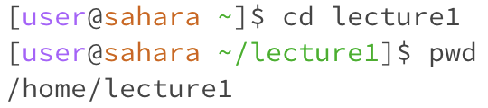
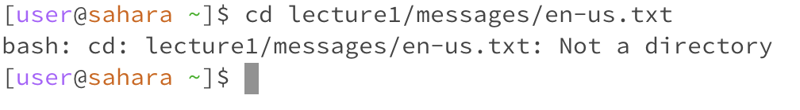
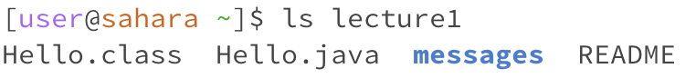
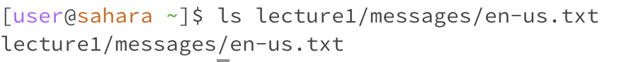
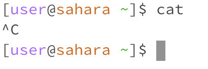
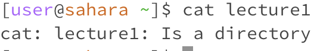
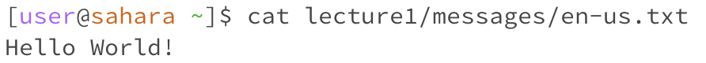

<h1>Lab Report 1</h1>

by Guan Hao Huang Chen

<b>cd command lines:</b>
 
1.
 

Screen Shot:

 

The working directory was home/

There were no result so I didn't take a screen shot to it, the reason it is no result is because cd command means change directory but we didn't specify which directory we want to change to so there is no result.

2.
 

Screen Shot:

 

The working directory was home/

The output shows on the next line before the commands, the current working directory changed to the directory called lecture1. The output is not an error and it is what we expect to get, we use command line change directory to lecture1 and now we are at lecture1.

3.
 

Screen Shot:

 

The working directory was home/

I got the output as "bash: cd: lecture1/messages/en-us.txt: Not a directory" and this is because I use a file as an argument, cd is for directory. The output is an error because we want to change the current directory to the argument directory but our argument is not a directory so it shows error output telling us is not able to change.

<b>ls command lines:</b>
 
1. 
 

Screen Shot:

 

The working directory was home/

The result was lecture1 and the reason we get this result is because in the home directory there were only one directory or file called lecture1. This was not an error because list the items in the working directory was what we expected.

2.
 

Screen Shot:

 

The working directory was home/

The result was Hello.class Hello.java messages README and the reason we get this result is because in the lecture1 directory there were only one directory or file called lecture1. This was not an error because list the items in the working directory was what we expected.

3.
 

Screen Shot:

 

The working directory was home/

The result was lecture1/messages/en-us.txt and the reason we get this result is because en-us.txt is not an directory so the computer can't list anything inside it. This shoule be an error because the result is not listing.

<b>cat command lines:</b>
1. 
 

Screen Shot:

 

The working directory was home/

The result was empty but no next line, I have to use control c to stop it, I think the reason is because cat with no argument would cause nothing to print and it is an error so it would be empty.

2.
 

Screen Shot:

 

The working directory was home/

The result was lecture1 Is a directory. And this is because the argument we use for the cat command is directory. This is an error because cat should print out the information inside a file and it didn't print out anything (because we use directory as argument.)

3.
 

Screen Shot:

 

The working directory was home/

The result was Hello World! because the information inside the file en-us.txt was Hello World!. This is not an error because this is what we expected to get from the command cat which is print the information of the argument.

