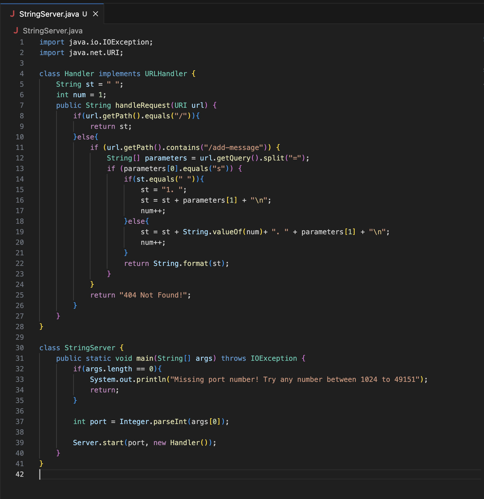

By Guan Hao Huang Chen

My codes:

 

ScreenShot 1:

<b>
Which methods in your code are called?
</b>

When I make a request to the the local host url, I call the method Server.start(port, new Handler()) which is handleRequest(URI url) in my Handler class.

<b>
What are the relevant arguments to those methods, and the values of any relevant fields of the class?
</b>

For the handlerRequest(URI url) method, the argument URI represent the link "http://localhost:2048/add-message?s=hello". The relevant fields of the Handler class would be String st that is set to be " " and int num that is set to 1.

<b>
How do the values of any relevant fields of the class change from this specific request? If no values got changed, explain why.
</b>

The given request url path is with /add-message with query s=hello. The code first check if the path is / and it is not so it go to else. The code checks if the path contains /add-messageand it does. So the code proceeds inside this block and splits the query using = sign, and safe result into array parameters with value {"s", "hello"}. It checks if parameters[0] = "s", and it does, so parameters[1] would update to String st which how st is "1. hello\n" and num increases for the next term needed.

